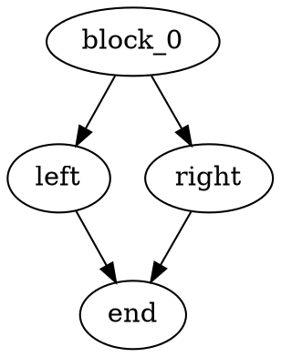

# LLVM DAG / DOT to yEd GraphML Converter

> **AI-Generated Notice (Important)**
>
> This repository (including `dot2xml.py`, documentation, and examples) is **partially or largely generated with AI assistance** based on iterative prompts.  
> **Please review the code carefully before using it in production**, and validate the output on your own DOT inputs and toolchain versions (LLVM / Graphviz / yEd).  
> If you find issues or incompatibilities, contributions and bug reports are welcome.

[](https://opensource.org/licenses/MIT)
[](https://www.python.org/)

[English](#english) | [中文说明](#中文说明) | [AI Prompt Log](#ai-prompt-log)

---

<a name="english"></a>
## English

A Python tool for compiler developers that converts Graphviz `.dot` graphs (including LLVM SelectionDAG graphs) into **yEd-compatible `.graphml`** files.

Compared to importing DOT directly into yEd / yEd Live, this converter:

- Preserves layout coordinates from Graphviz (`dot -Tjson`)
- Reconstructs LLVM’s complex **record / Mrecord labels** into yEd-rendered **HTML tables**
- Preserves **edge color/style** (e.g. dashed, dotted, bold) as yEd edge styles
- Correctly handles **normal nodes** (non-table nodes) and avoids the common `\N` label issue
- Supports a **JSON config file** to customize node/table-node/edge styles

> Note: yEd Live (online) may not fully support HTML table labels. For the best results, use the desktop yEd Graph Editor.

---

### Features

- **Normal node label fix**: Graphviz may emit `label="\N"` meaning “use node name”. This script resolves `\N` to the real node name so yEd displays correct labels.
- **LLVM Record Parsing**: Parses LLVM-style record labels into structured fields:
  - Inputs
  - Operator
  - Node ID
  - Outputs
- **Native HTML tables in yEd**: Uses CDATA-wrapped HTML `<table>` so yEd renders the node like Graphviz.
- **Configurable styling**:
  - Default node style
  - Table node style
  - Per-node overrides by regex (e.g. highlight `block_0`, `end`)
  - Default edge style + mapping Graphviz styles to yEd

---

### Prerequisites

- Python 3.x
- [Graphviz](https://graphviz.org/) installed
  - `dot` must support `-Tjson`
  - Either add `dot` to PATH, or specify its path in the config file

---

### Usage

#### 1) Basic conversion (auto output)

If you don’t specify an output file, the script will automatically use:

- `input.dot` → `input.graphml`

```bash
python dot2xml.py input.dot
```

#### 2) Specify output filename

```bash
python dot2xml.py input.dot -o output.graphml
```

#### 3) Use a config file (recommended)

```bash
python dot2xml.py input.dot -c config.json
```

---

### Config File (config.json)

The converter supports a JSON configuration file for styling and Graphviz executable path.

Example:

```json
{
  "graphviz": {
    "dot_executable": "F:\\\\Downloads\\\\Graphviz\\\\bin\\\\dot"
  },
  "layout": {
    "scale_pos": 2.5,
    "flip_y": true
  },
  "nodes": {
    "default": {
      "fill_color": "#F9F9F9",
      "border_color": "#000000",
      "border_width": 1.0,
      "shape": "roundrectangle",
      "font_family": "Consolas",
      "font_size": 12,
      "font_color": "#000000"
    },
    "table": {
      "fill_color": "#FFFFFF",
      "border_color": "#1F4E79",
      "border_width": 1.0,
      "shape": "rectangle",
      "font_family": "Consolas",
      "font_size": 11,
      "font_color": "#1F4E79"
    },
    "overrides": [
      { "match": "^block_0$", "style": { "fill_color": "#D9EAD3", "border_color": "#38761D" } },
      { "match": "^end$", "style": { "fill_color": "#F4CCCC", "border_color": "#990000" } }
    ]
  },
  "edges": {
    "default": {
      "color": "#333333",
      "width": 1.2,
      "style": "line",
      "arrow_target": "standard",
      "arrow_source": "none"
    },
    "bold_width": 2.5,
    "color_map": {
      "blue": "#1155CC",
      "red": "#CC0000",
      "black": "#000000"
    }
  }
}
```

---

### Typical Workflow (LLVM SelectionDAG)

1. Generate a DAG `.dot` file (for example via `llc -view-isel-dags`).
2. Convert to `.graphml`:

```bash
python dot2xml.py main.dot -c config.json
```

3. Open `main.graphml` in **yEd Graph Editor** and adjust layout interactively.

---

### Troubleshooting

- **All nodes show `\N` in yEd**
  - This typically happens when Graphviz uses `label="\N"` as a placeholder.
  - This script fixes it automatically by replacing `\N` with the node name.
- **Graphviz failed / dot not found**
  - Ensure Graphviz is installed and `dot` is in PATH, or configure `graphviz.dot_executable` in `config.json`.
- **yEd Live doesn’t show HTML tables**
  - Use desktop yEd for full HTML label rendering.

---

<a name="中文说明"></a>
## 中文说明

这是一个面向编译器开发者的 Python 工具，用于将 Graphviz 的 `.dot` 图（包括 LLVM SelectionDAG 输出的 DAG 图）转换为 **yEd 可编辑的 `.graphml`** 文件。

相比直接导入 DOT 到 yEd / yEd Live，本工具可：

- 从 `dot -Tjson` 中提取并保留 Graphviz 的布局坐标
- 将 LLVM 复杂的 **record/Mrecord 标签**解析并重建为 yEd 可渲染的 **HTML 表格**
- 保留连线颜色/线型（虚线、点线、加粗等）
- 正确支持 **普通节点（非表格节点）**，并修复常见的 `\N` 标签显示问题
- 支持通过 **JSON 配置文件**统一指定节点/表格节点/连线的颜色和样式

> 注意：yEd Live（网页版）对 HTML 表格标签支持可能不完整。建议使用桌面版 yEd Graph Editor 打开导出的 GraphML。

---

### 核心特性

- **普通节点 `\N` 修复**  
  Graphviz 的 `\N` 是“节点名占位符”。当 `dot -Tjson` 输出 `label="\\N"` 时，脚本会自动替换为真实节点名，避免 yEd 显示 `\N`。

- **LLVM Record 解析**  
  将 LLVM 常见 record/Mrecord label 解构为：
  - Inputs（输入）
  - Operator（操作符）
  - Node ID（节点编号）
  - Outputs（输出）

- **yEd 原生 HTML 表格渲染**  
  使用 CDATA 包裹 HTML `<table>`，让 yEd 在节点内渲染表格布局，尽量贴近 Graphviz 的视觉效���。

- **样式可配置**  
  通过 `config.json` 可配置：
  - 普通节点默认样式
  - 表格节点默认样式
  - 按节点名正则匹配的样式覆盖（例如高亮 `block_0` / `end`）
  - 连线默认样式 + Graphviz 颜色映射

---

### 环境依赖

- Python 3.x
- 安装 [Graphviz](https://graphviz.org/)，并确保 `dot` 支持 `-Tjson`
  - 可将 `dot` 加入 PATH
  - 或在配置文件里指定 `graphviz.dot_executable` 路径

---

### 使用方法

#### 1) 基础用法（自动输出文件名）

未指定输出文件名时，脚本默认生成同名 `.graphml`：

- `input.dot` → `input.graphml`

```bash
python dot2xml.py input.dot
```

#### 2) 指定输出文件名

```bash
python dot2xml.py input.dot -o output.graphml
```

#### 3) 使用配置文件（推荐）

```bash
python dot2xml.py input.dot -c config.json
```

---

### LLVM SelectionDAG 常见流程

1. 使用 LLVM 工具生成 `.dot`（例如 `llc -view-isel-dags`）。
2. 执行转换：

```bash
python dot2xml.py main.dot -c config.json
```

3. 使用桌面版 yEd 打开 `main.graphml`，即可自由拖拽排版和美化。

---

### 常见问题

- **yEd 中节点显示为 `\N`**
  - Graphviz 的 `\N` 是“节点名占位符”。本脚本已自动替换为真实节点名。
- **找不到 dot / Graphviz 执行失败**
  - 请确保 `dot` 在 PATH 中，或者在 `config.json` 里设置 `graphviz.dot_executable`。
- **yEd Live 无法显示 HTML 表格**
  - 建议使用桌面版 yEd 以获得完整渲染效果。

---

<a name="ai-prompt-log"></a>
## AI Prompt Log

Below is the prompt history used to iteratively generate/refine this project (kept for transparency and reproducibility).

### First round

我使用llvm的llc工具为我生成了DAG图对应的dot文件，但直接使用Graphviz的dot工具对其进行转换的话生成的是一张图片，而我需要对其中的节点、线进行调整，使其美观。为我撰写对应的脚本将dot文件转为利于其他工具导入进行拖拽编辑的格式。还有我知道，yEd Live 支持对dot文件编辑，但它不支持dot图像的样式，与Graphviz的dot工具转换出来的图片，相差很大且不美观，如上局部图的对比；还有我提供的dot文件供你参考dot文件的格式

### Second round

使用dot2xml.py转换dot文件为graphml，虽然graphml文件可以正确导入了，但图像效果不符合我的预期： 

图1分别是dot工具转换生成的DAG图，节点包含的内容不只是节点编号还有节点的信息（输入，输出，操作符等等），图2则为导入yEd的结果，只有节点编号信息，不符合我的需求。 

main.dot为原dot文件，main.graphml为转换后的输出，根据这些信息 继续完善代码，实现我的要求

### Third round

main.dot是我的dot文件，图片都是我需要节点样式的示例 ，现在我需要你使用脚本我提取各个节点在dot文件的内容定义label和对应呈现在图片中节点的信息，方便后续输出到对应的graphml的节点中

节点内容： 

操作节点：输入(0,1,2,3)、操作符号（RISCVISD::CALL）、节点编号（t1、t2...)、 输出（类型、ch、glue） 

常量、帧索引全局变量等符号：作为常量、帧索引全局变量等符号存在时的符号定义（TargetConstant<0>、RegisterMask、Register $x10、TargetGlobalAddress<i64 (i64,i64)* @add> 0 [TF=1]、FrameIndex<1>)、节点编号（t1、t2...)、 输出（类型、ch、glue）

### Fourth round

dot2xml.py脚本执行结果不正确 问题：对于dot文件中的普通节点（非表格信息）信息提取失败， dot文件：



dot转换结果：图片1  

脚本转换结果：图片2  

继续完善代码，并提供使用配置文件的方式对节点（包括表格节点）颜色和样式、线的格式的指定；还有对参数的指定，如果用户没有指定输出文件名，默认使用输入文件名，只需更改文件后缀为graphml。

---

**License**: MIT
